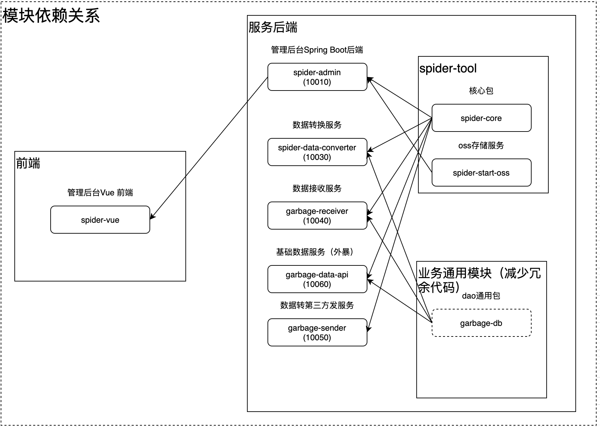

# **快速开发管理平台-boot版本（多租户版本）** 

## **项目结构** 
```
spider-boot
├─spider-admin   垃圾分类管理平台（后台）-多租户版本   port:10010
├─spider-data-converter   数据转换服务,集成              port:10030
├─spider-db   DB通用module
├─spider-receiver   数据接收服务，集成rabbitmq                    port:10040
├─spider-data-api   基础数据服务（外暴）             port:10060
├─spider-sender 数据转第三方发服务，集成rabbitmq                 port:10050
└─


```

## **技术选型：** 
- 核心框架：Spring Boot 2.0
- 安全框架：Apache Shiro 1.4
- 视图框架：Spring MVC 4.3
- 持久层框架：MyBatis 3.3
- 定时器：Quartz 2.3
- 数据库连接池：Druid 1.0
- 日志管理：SLF4J 1.7、Log4j
- 页面交互：Vue2.x 
<br> 

## **服务架构图**


## **模块关系图**
